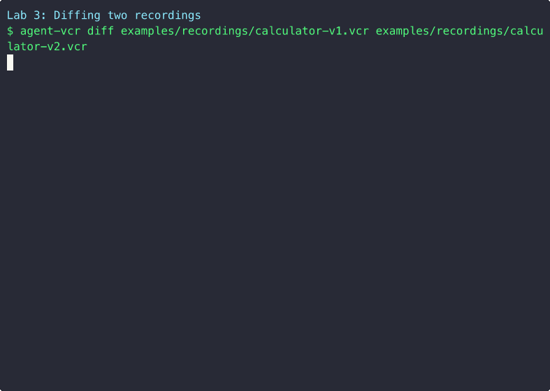
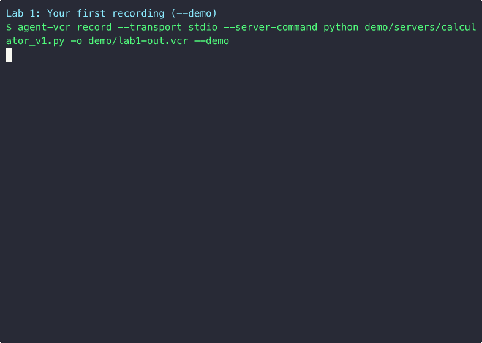
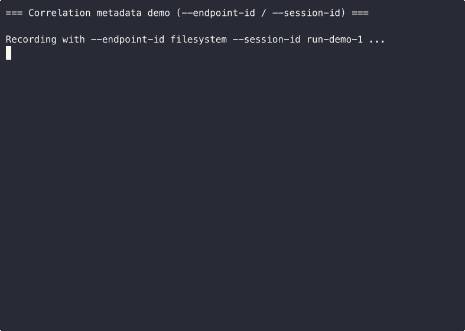

# Agent VCR

**Record, replay, and diff MCP interactions — like VCR for AI agents.**

Test MCP servers and clients without flaky live servers. **Mock MCP for testing**: record once, replay forever. No more "MCP server was down" or "rate limit" in CI — deterministic, fast, offline.

[](https://github.com/jarvis2021/agent-vcr/actions/workflows/tests.yml)
[](https://opensource.org/licenses/MIT)
[](https://www.python.org/downloads/)
[](https://nodejs.org/)


Agent VCR is a testing framework for the [Model Context Protocol (MCP)](https://modelcontextprotocol.io). It transparently records all JSON-RPC 2.0 interactions between an MCP client and server, then replays them deterministically — no real server needed. **Easier than rolling your own mocks:** one install, one command to record, one to replay. Golden cassettes in seconds.

**Python and TypeScript are first-class.** The Python implementation has 190+ tests and a full CLI; the TypeScript implementation has 72 unit tests, full CLI, and is **npm-ready** (`@agent-vcr/core`) — ideal for the TypeScript-first MCP ecosystem, where most MCP servers and clients live. Recordings are cross-language: record with Python, replay with TypeScript (or the other way around). See [typescript/README.md](typescript/README.md).


## The Problem

If you're building MCP servers or clients, you've hit these walls:

**"My tests are flaky because they depend on a live server."** External MCP servers go down, rate-limit, or return different results each run. Your CI pipeline fails for reasons that have nothing to do with your code.

**"I can't test error handling without breaking the server."** How do you verify your client handles a timeout, a malformed response, or a server crash? You'd need to modify the server itself — or just hope for the best.

**"I shipped a breaking change and didn't catch it."** You updated your MCP server and a downstream client broke. There was no way to detect that `tools/call` started returning a different schema until a user filed a bug.

**"Testing against real APIs is slow and expensive."** Each test run hits the real server, waits for real responses, and burns through API quotas. A test suite that should take seconds takes minutes.

## How Agent VCR Solves This

Record your MCP interactions once against the real server, save them as `.vcr` cassettes, and replay them forever:

```
                Record (once)              Replay (every test run)
                ─────────────              ─────────────────────────
Client ←→ Agent VCR ←→ Real Server    Client ←→ Agent VCR (mock)
                │                                    │
                └──→ session.vcr ────────────────────┘
```

- **Deterministic**: Same input, same output, every time
- **Fast**: No network calls, instant responses
- **Offline**: Tests run without server access
- **Safe**: Inject errors without modifying the real server
- **Visible**: Diff two recordings to catch regressions before they ship

**Result:** CI that used to be slow and flaky (live MCP server, timeouts, rate limits) becomes fast and deterministic — run in seconds, catch breaking changes before deploy.

## Real-World Use Cases

**Open source MCP server authors:** Ship a `.vcr` cassette with your server so users can run their client tests without installing or running your server — a distribution story nobody else enables.
**Enterprises with multi-agent systems:** Many AI agents talking to many MCP servers? When server team A pushes a new version, the diff feature catches breaking changes before production. Platform teams use Agent VCR to gate deploys.
**CI/CD:** No more flaky tests because an MCP server was down, rate-limited, or slow. Record golden cassettes; tests run in milliseconds, deterministic every time.
**Cost control:** MCP servers that call paid APIs? Record once — never burn quota again in tests.

## Real-World Examples

### 1. Golden Cassette Testing
Record a "known good" session, commit the `.vcr` file to your repo, and replay it in CI. If your code changes break the interaction pattern, the test fails immediately.

```bash
# Record the golden cassette (once, using the included demo server)
agent-vcr record --transport stdio --server-command "python demo/servers/calculator_v1.py" -o cassettes/golden.vcr

# Every CI run replays it
pytest tests/ --vcr-dir=cassettes
```

### 2. MCP Server Compatibility Gates
Before deploying a new server version, record both old and new, then diff:

```bash
agent-vcr record --transport stdio --server-command "python demo/servers/calculator_v1.py" -o v1.vcr
agent-vcr record --transport stdio --server-command "python demo/servers/calculator_v2.py" -o v2.vcr
agent-vcr diff v1.vcr v2.vcr --fail-on-breaking
```



If `tools/call` changed its response schema, or a method was removed, the diff catches it and exits with code 1 — blocking the deploy.

### 3. Error Injection for Resilience Testing
Use response overrides to simulate failures without modifying the server:

```python
replayer = MCPReplayer(recording)

# Inject a server error for request id=3
replayer.set_response_override(3, {
    "jsonrpc": "2.0",
    "id": 3,
    "error": {"code": -32603, "message": "Internal server error"}
})

# Your client code should handle this gracefully
response = replayer.handle_request(request)
assert handle_error(response) == expected_fallback
```

### 4. Offline Development
Working on a plane? At a coffee shop with bad WiFi? Record your MCP server interactions beforehand and develop against the replay:

```bash
# Before going offline
agent-vcr record --transport sse --server-url http://localhost:3000/sse -o dev-session.vcr

# While offline — full mock server on port 3100
agent-vcr replay --file dev-session.vcr --transport sse --port 3100
```

### 5. Multi-Agent Regression Testing
When multiple AI agents share MCP infrastructure, one agent's server change can break another. Agent VCR lets each team maintain their own cassettes and run compatibility checks independently.

### 6. Protocol Evolution Tracking
As the MCP spec evolves, use diffs to track how your server's behavior changes across protocol versions:

```python
result = MCPDiff.compare("mcp-2024-11.vcr", "mcp-2025-03.vcr")
print(f"Added methods: {len(result.added_interactions)}")
print(f"Breaking changes: {len(result.breaking_changes)}")
```

## Quick Start

> **New to Agent VCR?** Follow the [hands-on tutorial](docs/tutorial.md) — 12 labs covering every use case with real commands.

### Installation

**Python:**
```bash
# Recommended
uv pip install agent-vcr

# Or with pip
pip install agent-vcr
```

**TypeScript/Node.js:**
```bash
npm install @agent-vcr/core
# or
pnpm add @agent-vcr/core
```

### Record a session

```bash
# Record stdio-based MCP server (try it now with the included demo server)
agent-vcr record --transport stdio --server-command "python demo/servers/calculator_v1.py" -o session.vcr

# Record SSE-based MCP server (replace URL with your server)
agent-vcr record --transport sse --server-url http://localhost:3000/sse -o session.vcr
```



### Replay as a mock server

```bash
# Replay via stdio (pipe to your client)
agent-vcr replay --file session.vcr --transport stdio

# Replay via HTTP+SSE
agent-vcr replay --file session.vcr --transport sse --port 3100
```


### Diff two recordings

```bash
agent-vcr diff baseline.vcr current.vcr
agent-vcr diff baseline.vcr current.vcr --format json --fail-on-breaking
```

### Index and search many cassettes

```bash
agent-vcr index recordings/ -o index.json
agent-vcr search index.json --method tools/list
agent-vcr search index.json --endpoint-id github
```

### Batch diff

```bash
# pairs.json: {"pairs": [{"baseline": "v1.vcr", "current": "v2.vcr"}, ...]}
agent-vcr diff-batch pairs.json --fail-on-breaking
```

### Inspect a recording

```bash
agent-vcr inspect session.vcr
agent-vcr inspect session.vcr --format table
```

## Match Strategies

The replayer supports 5 matching strategies for finding recorded responses:

| Strategy | Description | Use Case |
|----------|-------------|----------|
| `exact` | Full JSON match (excluding jsonrpc and id fields) | Strictest testing |
| `method` | Match by method name only | Broad matching |
| `method_and_params` | Match method + full params *(default)* | Standard testing |
| `subset` | Match method + partial params (subset) | Flexible testing |
| `sequential` | Return interactions in order | Ordered replay |

*Note: The `fuzzy` strategy is deprecated; use `subset` instead. `fuzzy` is kept as an alias for backward compatibility.*

## Replayer Features

The replayer supports latency simulation for realistic testing:

```bash
# Simulate latency during replay
agent-vcr replay --file session.vcr --simulate-latency

# Scale recorded latencies (1.0 = original, 2.0 = double)
agent-vcr replay --file session.vcr --simulate-latency --latency-multiplier 2.0
```

## Diff Features

Enhanced diff capabilities:

```bash
# Compare latency between recordings
agent-vcr diff baseline.vcr current.vcr --compare-latency
```

## Try It Now

The repo ships with sample `.vcr` cassettes so you can try the CLI immediately:

```bash
# Inspect a recording
agent-vcr inspect examples/recordings/calculator-v1.vcr

# Diff two server versions — spot the new tool and schema changes
agent-vcr diff examples/recordings/calculator-v1.vcr examples/recordings/calculator-v2.vcr

# See error handling in action
agent-vcr inspect examples/recordings/calculator-errors.vcr
```

Sample cassettes included:

| File | Description | Interactions |
|------|-------------|:------------:|
| `calculator-v1.vcr` | Calculator MCP server v1 — add, multiply | 3 |
| `calculator-v2.vcr` | Calculator v2 — adds divide tool + response metadata | 4 |
| `calculator-errors.vcr` | Error scenarios — division by zero, method not found | 4 |

## Programmatic Usage

### Creating recordings manually

```python
from datetime import datetime
from agent_vcr.core.format import (
    JSONRPCRequest, JSONRPCResponse, VCRInteraction,
    VCRMetadata, VCRRecording, VCRSession,
)

# Build the initialize handshake
init_req = JSONRPCRequest(id=0, method="initialize", params={
    "protocolVersion": "2024-11-05",
    "clientInfo": {"name": "my-client", "version": "1.0.0"},
})
init_resp = JSONRPCResponse(id=0, result={
    "protocolVersion": "2024-11-05",
    "serverInfo": {"name": "my-server", "version": "1.0.0"},
    "capabilities": {"tools": {}},
})

# Build an interaction
interaction = VCRInteraction(
    sequence=0,
    timestamp=datetime.now(),
    direction="client_to_server",
    request=JSONRPCRequest(id=1, method="tools/list", params={}),
    response=JSONRPCResponse(id=1, result={
        "tools": [{"name": "echo", "description": "Echo a message"}]
    }),
    latency_ms=12.5,
)

# Assemble and save
recording = VCRRecording(
    metadata=VCRMetadata(
        version="1.0.0",
        recorded_at=datetime.now(),
        transport="stdio",
    ),
    session=VCRSession(
        initialize_request=init_req,
        initialize_response=init_resp,
        interactions=[interaction],
    ),
)
recording.save("session.vcr")
```

### Replaying in code

```python
from agent_vcr.core.format import VCRRecording
from agent_vcr.replayer import MCPReplayer

recording = VCRRecording.load("session.vcr")
replayer = MCPReplayer(recording, match_strategy="method_and_params")

response = replayer.handle_request({
    "jsonrpc": "2.0",
    "id": 1,
    "method": "tools/list",
    "params": {}
})
print(response)  # Returns the recorded response
```

### Diffing recordings

```python
from agent_vcr.diff import MCPDiff

result = MCPDiff.compare("baseline.vcr", "current.vcr")

if result.is_identical:
    print("No changes!")
elif result.is_compatible:
    print(f"Compatible changes: {len(result.modified_interactions)} modified")
else:
    print("Breaking changes detected!")
    for change in result.breaking_changes:
        print(f"  - {change}")
```

## Pytest Integration

Agent VCR includes a pytest plugin for seamless test integration.

### Using fixtures

```python
import pytest

@pytest.mark.vcr("cassettes/test_tools_list.vcr")
def test_tools_list(vcr_replayer):
    """Test that tools/list returns expected tools."""
    response = vcr_replayer.handle_request({
        "jsonrpc": "2.0",
        "id": 1,
        "method": "tools/list",
        "params": {}
    })
    assert "result" in response
    assert len(response["result"]["tools"]) > 0
```

### Using the async context manager

```python
from agent_vcr.pytest_plugin import vcr_cassette

async def test_with_cassette():
    async with vcr_cassette("my_test.vcr") as cassette:
        response = cassette.replayer.handle_request({
            "jsonrpc": "2.0",
            "id": 1,
            "method": "tools/call",
            "params": {"name": "echo", "arguments": {"message": "hello"}}
        })
        assert response["result"]["content"][0]["text"] == "hello"
```

### CLI options

```bash
pytest --vcr-record            # Record new cassettes
pytest --vcr-dir=my_cassettes  # Custom cassette directory
```


## VCR File Format

Recordings use a JSON-based `.vcr` format:

```json
{
  "format_version": "1.0.0",
  "metadata": {
    "version": "1.0.0",
    "recorded_at": "2026-02-07T10:30:00",
    "transport": "stdio",
    "client_info": {"name": "claude-desktop"},
    "server_info": {"name": "my-mcp-server"},
    "tags": {"env": "staging"}
  },
  "session": {
    "initialize_request": { "jsonrpc": "2.0", "id": 0, "method": "initialize", "params": {} },
    "initialize_response": { "jsonrpc": "2.0", "id": 0, "result": { "capabilities": {} } },
    "capabilities": {},
    "interactions": [
      {
        "sequence": 0,
        "timestamp": "2026-02-07T10:30:05",
        "direction": "client_to_server",
        "request": { "jsonrpc": "2.0", "id": 1, "method": "tools/list", "params": {} },
        "response": { "jsonrpc": "2.0", "id": 1, "result": { "tools": [] } },
        "latency_ms": 12.5
      }
    ]
  }
}
```

## Python vs TypeScript

The Python implementation is **complete and tested** (190 tests). The TypeScript/Node.js port mirrors the same architecture and has a **full unit test suite** (72 tests).

| Aspect | Python | TypeScript |
|--------|--------|------------|
| Status | Production-ready | 72 unit tests, source complete |
| Tests | 190 tests passing | 72 unit tests in `tests/unit/` |
| CLI | Fully functional | Fully functional |
| Test framework | pytest plugin | Jest/Vitest (replay mode) |
| Recording format | `.vcr` (JSON) | `.vcr` (JSON) — same format |
| Recording mode in integrations | Implemented | Planned for v0.2.0 |

**Cross-language recordings:** The `.vcr` format is plain JSON, so recordings created by Python are loadable by the TypeScript implementation.

## Scaling (Multi-MCP, Agent-to-Agent)

We support **multi-MCP** and **agent-to-agent**: record multiple sessions (one `.vcr` per client↔server session), tag each with `--session-id`, `--endpoint-id`, and `--agent-id`, and correlate them in your tests or tooling. **Indexing** (`agent-vcr index`, `agent-vcr search`) and **batch diff** (`agent-vcr diff-batch`) let you work across many cassettes. For design and agent-to-agent patterns, see [docs/scaling.md](docs/scaling.md).

**Example — correlation metadata (record with endpoint/session ids, inspect shows them):**



## Architecture

See [docs/architecture.md](docs/architecture.md) for the full system design, data flow diagrams, and design decisions.

**Python:**
```
python/src/agent_vcr/
├── core/
│   ├── format.py      # Pydantic models for .vcr format
│   ├── matcher.py     # Request matching strategies
│   └── session.py     # Session lifecycle management
├── transport/
│   ├── base.py        # Abstract transport interface
│   ├── stdio.py       # Subprocess stdio proxy
│   └── sse.py         # HTTP+SSE proxy
├── recorder.py        # Transparent recording proxy
├── replayer.py        # Mock server from recordings
├── diff.py            # Recording comparison engine
├── indexer.py         # Index/search many .vcr files
├── cli.py             # Command-line interface
└── pytest_plugin.py   # Pytest integration
```

**TypeScript:**
```
typescript/src/
├── core/
│   ├── format.ts      # Zod schemas for .vcr format
│   ├── matcher.ts     # Request matching strategies
│   └── session.ts     # Session lifecycle management
├── transport/
│   ├── base.ts        # Abstract transport interface
│   ├── stdio.ts       # Subprocess stdio proxy
│   └── sse.ts         # HTTP+SSE proxy
├── recorder.ts        # Transparent recording proxy
├── replayer.ts        # Mock server from recordings
├── diff.ts            # Recording comparison engine
├── cli.ts             # Command-line interface
└── integrations/
    ├── jest.ts        # Jest integration
    └── vitest.ts      # Vitest integration
```

## Development

### Python

```bash
# Clone and install
git clone https://github.com/jarvis2021/agent-vcr.git
cd agent-vcr/python

# Setup with uv (recommended)
uv venv
source .venv/bin/activate
uv pip install -e ".[dev]"

# Run tests
pytest tests/ -v

# Run with coverage
pytest tests/ --cov=src/agent_vcr --cov-report=html

# Lint
ruff check src/

# Type check
mypy src/
```

### TypeScript

```bash
cd agent-vcr/typescript

npm install
npm run build
npm test
```

### Creating demo GIFs

Use [asciinema](https://asciinema.org) and [agg](https://github.com/asciinema/agg). See **[demo/README-GIFS.md](demo/README-GIFS.md)** for per-lab commands (`bash demo/make-lab-gifs.sh <1-12>`) and the correlation demo (`demo/record-correlation-demo.sh`).

- **Record** (above): `assets/lab-1-record.gif` — from lab 1 (`make-lab-gifs.sh 1`), then `agg demo/lab-1.cast assets/lab-1-record.gif`.
- **Replay** (above): `assets/lab-2-replay.gif` — from lab 2 (`asciinema rec demo/lab-2.cast -c "bash demo/make-lab-gifs.sh 2"`), then `agg demo/lab-2.cast assets/lab-2-replay.gif`.
- **Diff** (Real-World Examples): `assets/lab-3-diff.gif`. **Correlation**: `assets/correlation-demo.gif` via `demo/record-correlation-demo.sh`.

### Run all tests (Python + TypeScript)

From the repo root:

```bash
cd python && uv run pytest tests/ -v
```

## Contributing

Contributions are welcome! Please see [docs/architecture.md](docs/architecture.md) for system design context and [CONTRIBUTING.md](CONTRIBUTING.md) for guidelines.

## License

[MIT](LICENSE)
